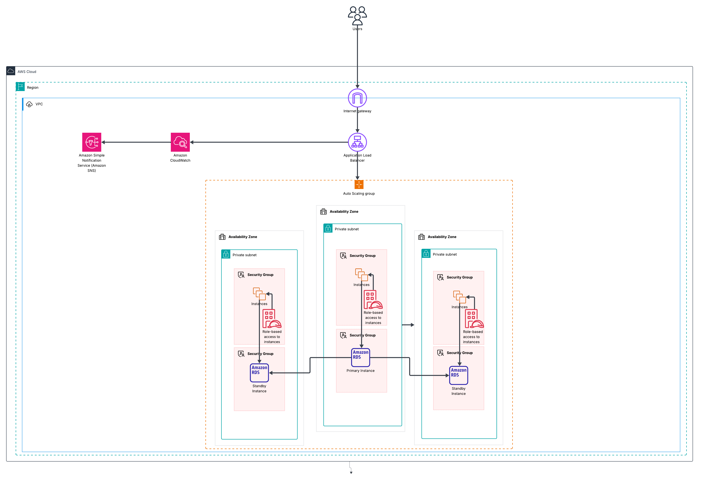

# 🏗️ Scalable Web Application on AWS (ALB + Auto Scaling)

> A highly available and scalable web architecture using EC2, ALB, ASG, and optionally Amazon RDS. Integrated with CloudWatch and SNS for monitoring and alerting.

---

## 📚 Table of Contents

1. [Project Overview](#project-overview)
2. [Architecture Diagram](#architecture-diagram)
3. [Solution Overview](#solution-overview)
4. [AWS Services Used](#aws-services-used)
5. [Deployment Steps](#deployment-steps)
6. [Monitoring and Alerts](#monitoring-and-alerts)
7. [Security Best Practices](#security-best-practices)
8. [Cost Optimization](#cost-optimization)
9. [Project Structure](#project-structure)
10. [Learning Outcomes](#learning-outcomes)

---

## 📌 Project Overview

This project showcases a robust, production-ready AWS architecture that auto-scales based on load, distributes traffic evenly across healthy instances, and maintains high availability. This is ideal for web applications expecting fluctuating traffic or requiring fault tolerance.

---

## 🗺️ Architecture Diagram

### 🔍 Components Breakdown

1. **Users**  
   End-users access the application via a browser.

2. **Internet Gateway**  
   Provides internet access to the public-facing Application Load Balancer.

3. **Application Load Balancer (ALB)**  
   Distributes incoming HTTP(S) requests across EC2 instances in multiple Availability Zones for high availability.

4. **Auto Scaling Group (ASG)**  
   Ensures that the right number of EC2 instances are running based on load. Instances span across **3 Availability Zones** for fault tolerance.

5. **EC2 Instances**  
   Host the web application. They are deployed in **private subnets** and managed via **role-based IAM access**.

6. **Amazon RDS**  
   A managed relational database service deployed with Multi-AZ support. One primary instance handles reads/writes; standby replicas ensure high availability.

7. **Amazon CloudWatch**  
   Monitors performance metrics like CPU utilization and 5XX error counts.

8. **Amazon SNS**  
   Sends notifications (e.g., email) when CloudWatch alarms are triggered.

---

## 🧩 Solution Overview

### 💡 Use Case

A Node.js or static web application that should:
- Scale during traffic spikes (e.g., sales event)
- Stay online during instance failure or AZ outage
- Alert operators on health or performance issues

### 🛠 How It Works

- **ALB** accepts incoming traffic and checks the health of registered EC2 targets.
- **ASG** maintains the desired number of EC2 instances, replacing unhealthy ones automatically.
- **CloudWatch** tracks metrics like 5XX errors or CPU > 70%.
- **SNS** sends alerts to a subscribed email or Lambda handler.
- **RDS Multi-AZ** handles backend data storage with automatic failover.

---

## 🧰 AWS Services Used

| Service        | Purpose                                  |
|----------------|-------------------------------------------|
| EC2            | Runs the web application                  |
| ALB            | Distributes and balances HTTP(S) traffic  |
| Auto Scaling   | Dynamically adjusts the number of instances |
| Amazon RDS     | Backend relational database (Multi-AZ)    |
| IAM            | Role-based access control                 |
| CloudWatch     | Logs, metrics, and alarms                 |
| SNS            | Sends notifications for critical events   |
| VPC/Subnets    | Network isolation and routing             |
| Internet Gateway | Access to the internet for ALB         |

---

## 🚀 Deployment Steps

1. **Create VPC and Subnets (3 AZs)**
2. **Launch EC2 Instance & Create Launch Template**
3. **Create ALB and Target Group**
4. **Create Auto Scaling Group (min=2, max=5)**
5. **Set Health Checks and Scaling Policies**
6. **Deploy RDS in Multi-AZ mode (Optional)**
7. **Configure IAM Roles and Security Groups**
8. **Enable CloudWatch Alarms and SNS Alerts**

---

## 📈 Monitoring and Alerts

### CloudWatch Metrics:
- `CPUUtilization`
- `HTTPCode_ELB_5XX_Count`
- `UnhealthyHostCount`

### Example Alarm:
- Trigger: `5XX errors >= 5 in 1 minute`
- Action: Publish message to SNS
- Result: Email alert sent to admin

---

## 🔐 Security Best Practices

- EC2 instances in **private subnets** only.
- Only ALB is internet-facing (public subnet).
- Use **IAM roles** instead of hardcoded credentials.
- Enable **RDS encryption** and use **security groups** to control access.
---

## 💸 Cost Optimization

- Use **Auto Scaling** for dynamic provisioning.
- Consider **Spot Instances** for stateless workloads.
- Use **CloudWatch** to identify underutilized resources.

---

## 🎓 Learning Outcomes

- Design and implement a fault-tolerant AWS web architecture.
- Use ALB and ASG for scalability and availability.
- Monitor and respond to system health issues using CloudWatch and SNS.
- Understand basic networking and IAM concepts in AWS.
